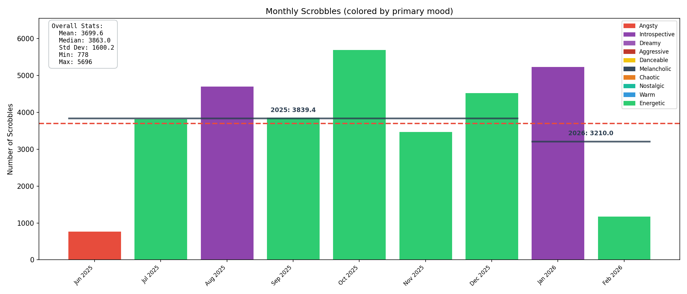
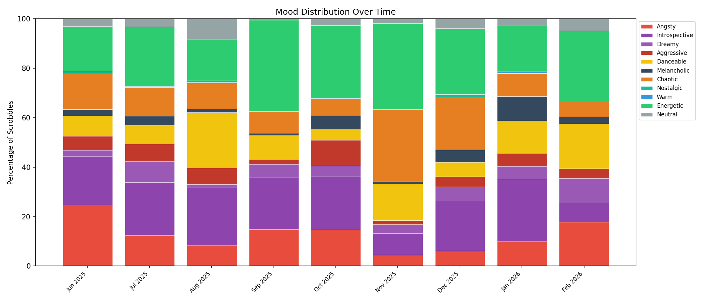
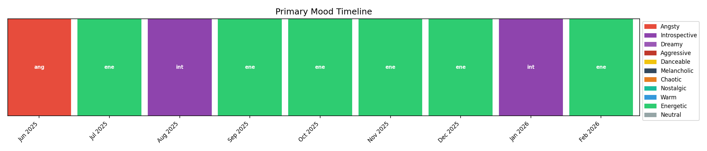
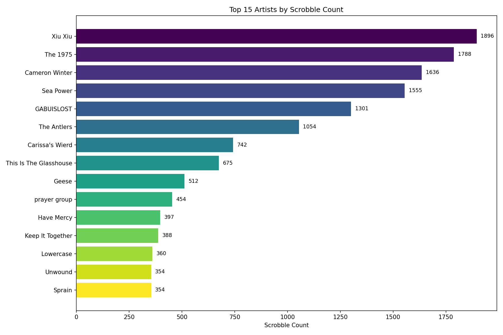
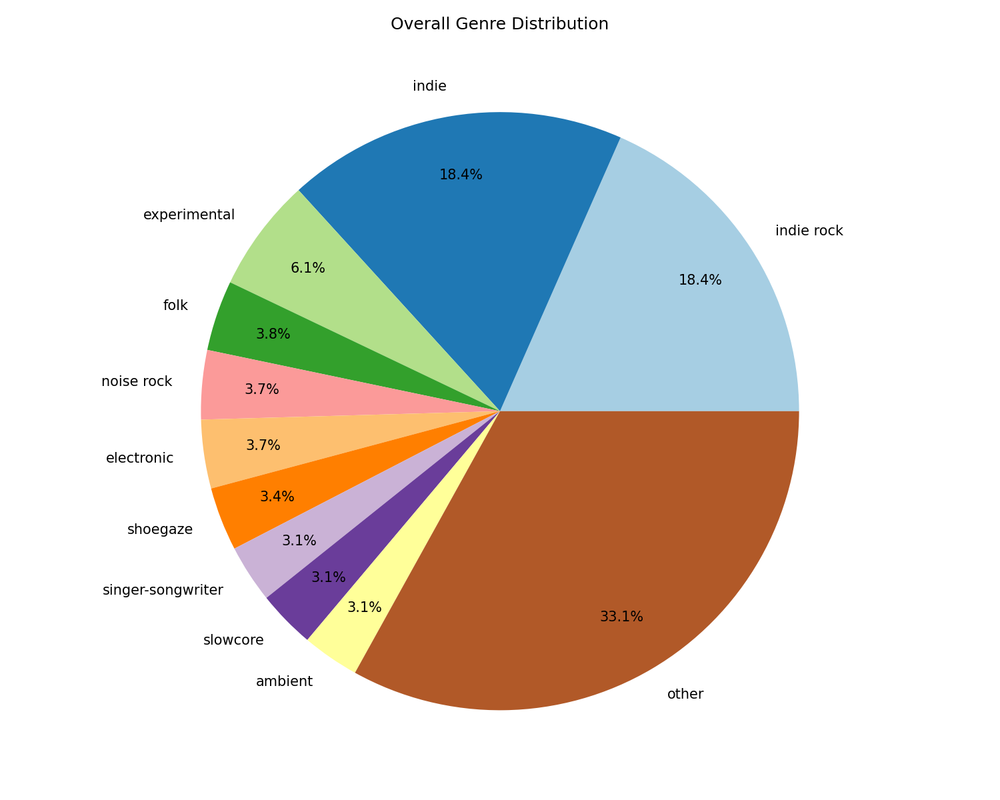
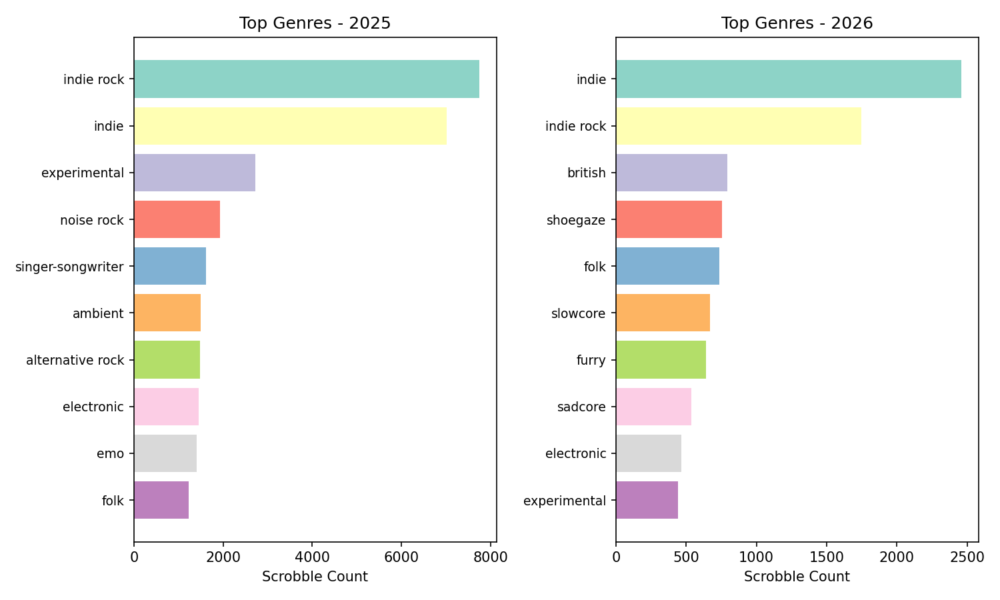
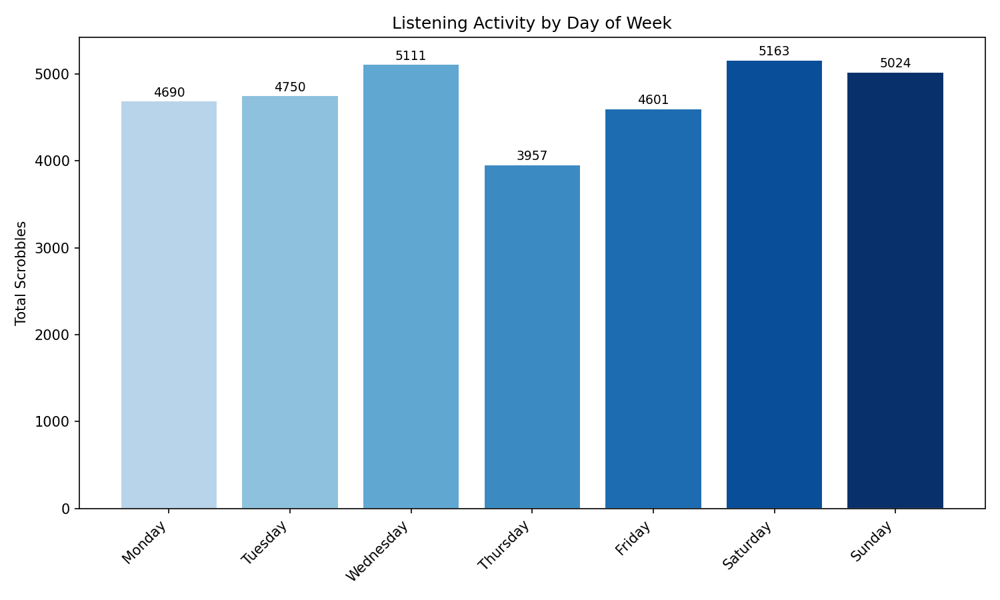
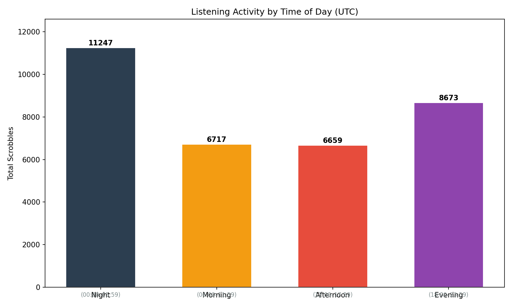
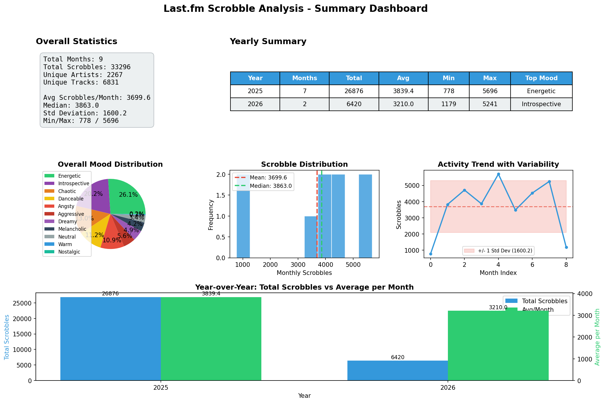

# [Last.fm](https://www.last.fm/user/Sir_Corndog) Scrobble Analysis

**Data Range:** June 2025 – February 2026 (9 months)
**Total Scrobbles:** 32,296 | **Unique Artists:** 2,267 | **Unique Tracks:** 6,831

---

## 1. Monthly Scrobble Activity

*Figure 1: Monthly scrobble counts colored by primary mood, with yearly average and overall median reference lines.*

This bar chart shows the number of scrobbles per month, with each bar colored by that month's primary mood classification.

- **Mean:** 3,699.6 scrobbles/month | **Median:** 3,863.0
- **Minimum month:** June 2025 at 778 scrobbles (partial month — account was created this month).
- **Maximum month:** October 2025 at 5,696 scrobbles.
- The 2025 yearly average (dashed dark line) sits at 3,839.4 scrobbles/month. The 2026 average is lower at 3,210.0, though only two months of 2026 data exist (January at ~5,200 and February at ~1,200, the latter being an incomplete month at time of analysis).
- The overall median (red dashed line) at 3,863.0 closely tracks the 2025 average, indicating a roughly symmetric distribution once the partial June month is accounted for.
- Excluding the two partial months (June 2025 and February 2026), monthly volume ranges between approximately 3,450 and 5,700, showing moderate variability.
- Two clear peaks are visible: August 2025 (~4,700) and October 2025 (~5,700). A dip occurs in November 2025 (~3,450) before recovering in December (~4,550) and peaking again in January 2026 (~5,200).

---

## 2. Mood Distribution Over Time

*Figure 2: Mood distribution over time as a 100% stacked bar chart across all 11 mood categories.*

A 100% stacked bar chart showing the percentage breakdown of all 11 mood categories per month.

- **Energetic** (green) and **Chaotic** (orange) consistently account for the largest combined share across all months, typically occupying 30–50% of each month's listening.
- **Danceable** (yellow) maintains a steady presence throughout, generally around 10–15% per month, with a notably larger share in November 2025 (~20%) and January 2026.
- **Angsty** (red) is most prominent in June 2025 (~25%), then drops to roughly 5–15% in subsequent months, with a slight increase in February 2026 (~18%).
- **Introspective** (purple) appears as a minor component in most months but becomes significantly more prominent in August 2025 (~15%) and January 2026 (~15%), the two months where it registers as the primary mood.
- **Dreamy** (lighter purple) holds a relatively small but consistent share of approximately 5–10% across the period.
- **Neutral** (gray) is visible in June and July 2025 and again in February 2026, but is negligible in other months.
- **Aggressive** (dark red) remains a small slice throughout, never exceeding roughly 5%.
- **Melancholic**, **Nostalgic**, and **Warm** are present but not really.

---

## 3. Primary Mood Timeline

*Figure 3: Primary mood per month displayed as a color-coded sequential timeline.*

A color-coded sequential timeline showing only the single dominant mood per month.

| Month | Primary Mood |
|-------|-------------|
| Jun 2025 | Angsty |
| Jul 2025 | Energetic |
| Aug 2025 | Introspective |
| Sep 2025 | Energetic |
| Oct 2025 | Energetic |
| Nov 2025 | Energetic |
| Dec 2025 | Energetic |
| Jan 2026 | Introspective |
| Feb 2026 | Energetic |

- **Energetic** is the dominant mood in 6 out of 9 months (67%).
- **Introspective** takes the lead in 2 months (August 2025 and January 2026).
- **Angsty** is the primary mood only in June 2025.
- No other mood category (Chaotic, Danceable, Dreamy, etc.) achieves primary status in any month, despite some holding substantial secondary shares in the stacked distribution.

---

## 4. Top Artists

*Figure 4: Top 15 most-played artists ranked by total scrobble count.*

A horizontal bar chart of the 15 most-played artists by total scrobble count.

| Rank | Artist | Scrobbles |
|------|--------|-----------|
| 1 | Xiu Xiu | 1,896 |
| 2 | The 1975 | 1,788 |
| 3 | Cameron Winter | 1,636 |
| 4 | Sea Power | 1,555 |
| 5 | GABUISLOST | 1,301 |
| 6 | The Antlers | 1,054 |
| 7 | Carissa's Wierd | 742 |
| 8 | This Is The Glasshouse | 675 |
| 9 | Geese | 512 |
| 10 | prayer group | 454 |
| 11 | Have Mercy | 397 |
| 12 | Keep It Together | 388 |
| 13 | Lowercase | 360 |
| 14 | Unwound | 354 |
| 15 | Sprain | 354 |

- There is a steep dropoff between the top 6 artists and the rest. The top 3 (Xiu Xiu, The 1975, Cameron Winter) each exceed 1,600 scrobbles, while artists ranked 7th and below fall under 750.
- The top 6 artists alone account for approximately 8,230 scrobbles, or roughly 25% of all listening.
- Xiu Xiu leads with 1,896 scrobbles, only ~6% ahead of The 1975 at 1,788.
- The bottom of the top 15 clusters tightly: positions 11–15 span only 43 scrobbles (354–397).

---

## 5. Overall Genre Distribution

*Figure 5: Overall genre distribution as a pie chart, showing the top 10 genres and an aggregated "other" slice.*

A pie chart showing the proportional breakdown of genres across all scrobbles.

| Genre | Share |
|-------|-------|
| indie | 18.4% |
| indie rock | 18.4% |
| experimental | 6.1% |
| folk | 3.8% |
| noise rock | 3.7% |
| electronic | 3.7% |
| shoegaze | 3.4% |
| singer-songwriter | 3.1% |
| slowcore | 3.1% |
| ambient | 3.1% |
| other | 33.1% |

- **Indie** and **indie rock** are tied as the two largest genre tags, together comprising 36.8% of all genre tags.
- The **"other"** category at 33.1% is the single largest slice, indicating a highly diverse long tail of genres beyond the top 10.
- The remaining 8 named genres (experimental through ambient) are tightly clustered between 3.1% and 6.1%, with no single genre breaking away from the pack.
- The top 10 genres account for 66.9% of all tags, meaning about one-third of listening falls outside these categories.

---

## 6. Top Genres by Year

*Figure 6: Top 10 genres compared side-by-side for 2025 and 2026.*

Side-by-side horizontal bar charts comparing the top 10 genres for 2025 (7 months of data) and 2026 (2 months of data, January and partial February).

### 2025
- **Indie rock** leads at approximately 7,800 scrobbles, followed by **indie** at ~7,000.
- **Experimental** is a distant third at ~3,000.
- The remaining genres (noise rock, singer-songwriter, ambient, alternative rock, electronic, emo, folk) cluster between approximately 1,200 and 2,000.

### 2026
- **Indie** leads at approximately 2,500 scrobbles, overtaking indie rock (~1,700).
- Several genres appear in the 2026 top 10 that were absent from 2025's list: **british**, **shoegaze**, **slowcore**, **furry**, and **sadcore**.
- **Experimental** drops from 3rd place in 2025 to 10th in 2026, falling to ~500 scrobbles.
- **Folk** rises from 10th in 2025 to 5th in 2026 with ~800 scrobbles.

### Year-over-Year Shifts
- The dominance of indie/indie rock persists in both years, though their relative ordering swaps.
- 2026 shows a broader spread of mid-tier genres (british, shoegaze, slowcore, furry, sadcore) compared to 2025's concentration around experimental and noise rock.

---

## 7. Listening Activity by Day of Week

*Figure 7: Total scrobbles aggregated by day of the week.*

A bar chart showing total scrobbles aggregated by day of the week across the full data range.

| Day | Scrobbles |
|-----|-----------|
| Monday | 4,690 |
| Tuesday | 4,750 |
| Wednesday | 5,111 |
| Thursday | 3,957 |
| Friday | 4,601 |
| Saturday | 5,163 |
| Sunday | 5,024 |

- **Saturday** has the highest total at 5,163, followed closely by **Wednesday** at 5,111 and **Sunday** at 5,024.
- **Thursday** is the lowest at 3,957, approximately 23% below Saturday.
- The distribution is relatively flat overall — the difference between the highest and lowest days is 1,206 scrobbles (a ~30% spread from min to max).
- Weekdays (Mon–Fri) average 4,622 scrobbles. Weekends (Sat–Sun) average 5,094, approximately 10% higher.

---

## 8. Listening Activity by Time of Day (UTC)

*Figure 8: Total scrobbles by time-of-day period (UTC).*

A bar chart showing total scrobbles across four time-of-day buckets in UTC.

| Period | UTC Range | Scrobbles |
|--------|-----------|-----------|
| Night | 00:00–05:59 | 11,247 |
| Morning | 06:00–11:59 | 6,717 |
| Afternoon | 12:00–17:59 | 6,659 |
| Evening | 18:00–23:59 | 8,673 |

- **Night** (00:00–05:59 UTC) is the highest-activity period at 11,247 scrobbles, accounting for ~34% of all listening.
- **Evening** (18:00–23:59 UTC) is the second-highest at 8,673 (~26%).
- **Morning** and **Afternoon** are nearly identical at 6,717 and 6,659 respectively (~20% each).
- Note: timestamps are in UTC and I'm lazy (e.g., UTC night hours correspond to evening in US timezones).

---

## 9. Summary Dashboard

*Figure 9: Comprehensive summary dashboard combining key statistics, yearly breakdown, mood distribution, scrobble histogram, activity trend, and year-over-year comparison.*

A multi-panel overview combining six visualizations:

- **Overall Statistics panel** confirms totals: 9 months, 32,296 scrobbles, 2,267 unique artists, 6,831 unique tracks.
- **Yearly Summary table** shows 2025 contributed 26,876 scrobbles and 2026 has contributed 6,420 scrobbles so far.
- **Mood pie chart** confirms Energetic as the largest mood slice, followed by Chaotic, then Danceable.
- **Scrobble Distribution histogram** shows monthly scrobble counts clustered between approximately 3,500–5,500 with the mean (3,699.6) and median (3,863.0) closely aligned.
- **Activity Trend line chart** plots monthly scrobble counts with a +/- 1 standard deviation band (1,600.2), showing most months fall within the band after the initial partial June.
- **Year-over-Year bar chart** compares total scrobbles (2025: 26,876 vs 2026: 6,420) and average per month (2025: ~3,839 vs 2026: ~3,210), though 2026 data is once again, in progress.

---

## Subjective Analysis

I was curious as to how my listening habits compared across my moods and mental state after journaling for two years. 

I only have 9 months of actual data to look at but I think the distribution lines up pretty well to what I expected. And it feels weird to know exactly what happened and when just based on Figure 2. 

If I had data on October 2024, I imagine it would have been the highest of the year (similar to 2025). A lot of things kinda just seem to happen in October, and I think I typically just drown all of it out with loud and aggressive music lol.

I did take a look at what was considered 'Danceable' and outside of Chappel Roan and some other 'Club' music, it really seems like they should have been lumped into Melancholic or Introspective, since Will Wood, GABUISLOST, and Broadcast are the majority in that category, and I wouldn't personally consider most of those songs Danceable for my purposes. Maybe something I could take a look at the genre classification for or maybe it was just from last.fm's db being weirdly categorized. 

The data showed one point that I wasn't expecting, which is where the months that had the most success or good events consistently had the least amount of scrobbles, while the worst months had the highest. 

But eh, it was a fun project to dive into, relearn python and look at how music was shaped by the events, positive and negative. 